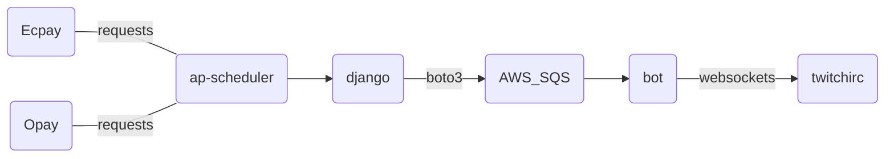

# Donate通知


* Database


OpayData
```json
{"lstDonate":[{"donateid":"13047311","name":"XXX","amount":100,"msg":"這是一筆贊助測試～"}],"settings":{"BgColor":"#00FF00","FontAnimate":"Wiggle","MsgTemplate":"非常感謝 {name} 贊助 {amount} 元!!","AlertSound":"","AlertSec":5,"AlertStyle":1,"TTSStatus":1,"TTSVolume":100,"AlertSoundVolume":100,"FontSize":50}}
```
新資料存在約20秒  

EcpayData
```json
[{"donateid":"10667070","name":"XXX","amount":100,"msg":"這是一筆贊助測試～"}]
```
新資料存在約10秒

[Twitch Bot Repo](https://github.com/virgil724/twitch_irc)
>(Ecpay這邊Alertbox好像API不用錢再打)

> Readme Will be sync with hackmd

